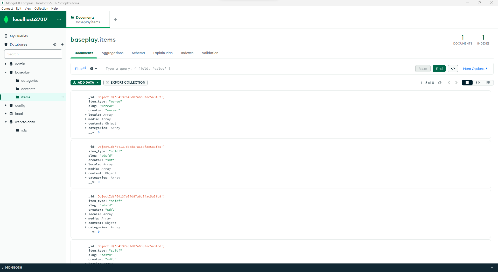
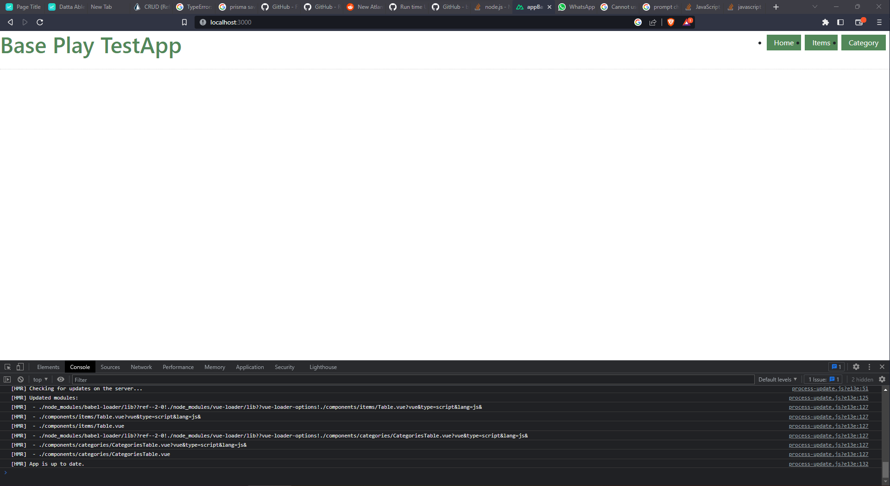

# **Project**  

CRUD Operations using Vue.js/Nuxt.js Front-end Framework and Backend Sservices with Mongoose ORM


This project demonstrates the implementation of CRUD (Create Read Update Delete) operations using the Vue.js/Nuxt.js-based front-end framework and Backend Service with an HTTP interface to perform CRUD operations on collections using Mongoose ORM.


### Prerequisites

Before running this project, you will need to have the following software installed:

1. Node.js v12 or higher
2. MongoDB v4.4 or higher


In the database do note that i created  a user called 'root' ,password: 'rootuser' or just copy and paste the following code in the mongo shell to create the user

```bash
use baseplay;
db.createUser({	user: "root",pwd: "rootuser",roles:[{role: "userAdminAnyDatabase" , db:"admin"}]})

```

this is the connection string I used in the backend check the env file . 


In most cases it's never a best cases or practise to include env in a repo but its for the demo purpose only . 


## Installation
 - Clone the repository from GitHub
 - Install dependencies: `npm install` in ech respective folders  ' frontend/appBaseplay    ' and ' backend/express-api '


## Usage

The web application provides a user interface for performing CRUD operations on items and categories. You can create, read, update, and delete items and categories using the web interface.

The backend microservices provide an HTTP interface to perform CRUD operations on the collections using Mongoose ORM. You can access the following endpoints:

To run the front end cd to folder ' frontend/appBaseplay ' and run the command ` npm run dev ` ; the application will be available at http://localhost:3000

To run the backend cd to folder ' backend/express-api ' and run the command ` npm run dev ` ; the application will be available at http://localhost:4130    , Do not change the port number for the back end as the front end uses it 


Endpoints:

### Items
1.POST http://localhost:4130/api/v1/items/save - Create a new item
2. POST http://localhost:4130/api/v1/items/update - Update an item
3. POST http://localhost:4130/api/v1/items/delete - Delete an item
4. GET http://localhost:4130/api/v1/items/all - Retrieve all items
5. GET  http://localhost:4130/api/v1/items/only/  - Retrieve a specific item

### Categories
1. POST http://localhost:4130/api/v1/category/save -  Create a new category
2. POST http://localhost:4130/api/v1/category/update - Update a category
3. GET http://localhost:4130/api/v1/category/only/   - Retrieve a specific category
4. GET  http://localhost:4130/api/v1/category/all - Retrieve all categories
5. POST http://localhost:4130/api/v1/category/delete - Delete a category

Please find the Insomnia workspace file in the root folder of the project. You can import the workspace file into Insomnia to test the endpoints. 
Look at the screenshots below for the application in action. or import this file 'Insomnia_2023-03-16.json' into Insomnia to test the endpoints.


To download Insomnia, visit https://insomnia.rest/and download the appropriate version for your operating system.


YouTube link : https://youtu.be/vvUsJkXFoFQ


[](https://www.youtube.com/watch?v=vvUsJkXFoFQ)


See screenshots below for the application in action:

## Some Insomia Screenshots


## Application Screenshots






[LICENSE](LICENSE)


## License


MIT: <https://rem.mit-license.org>